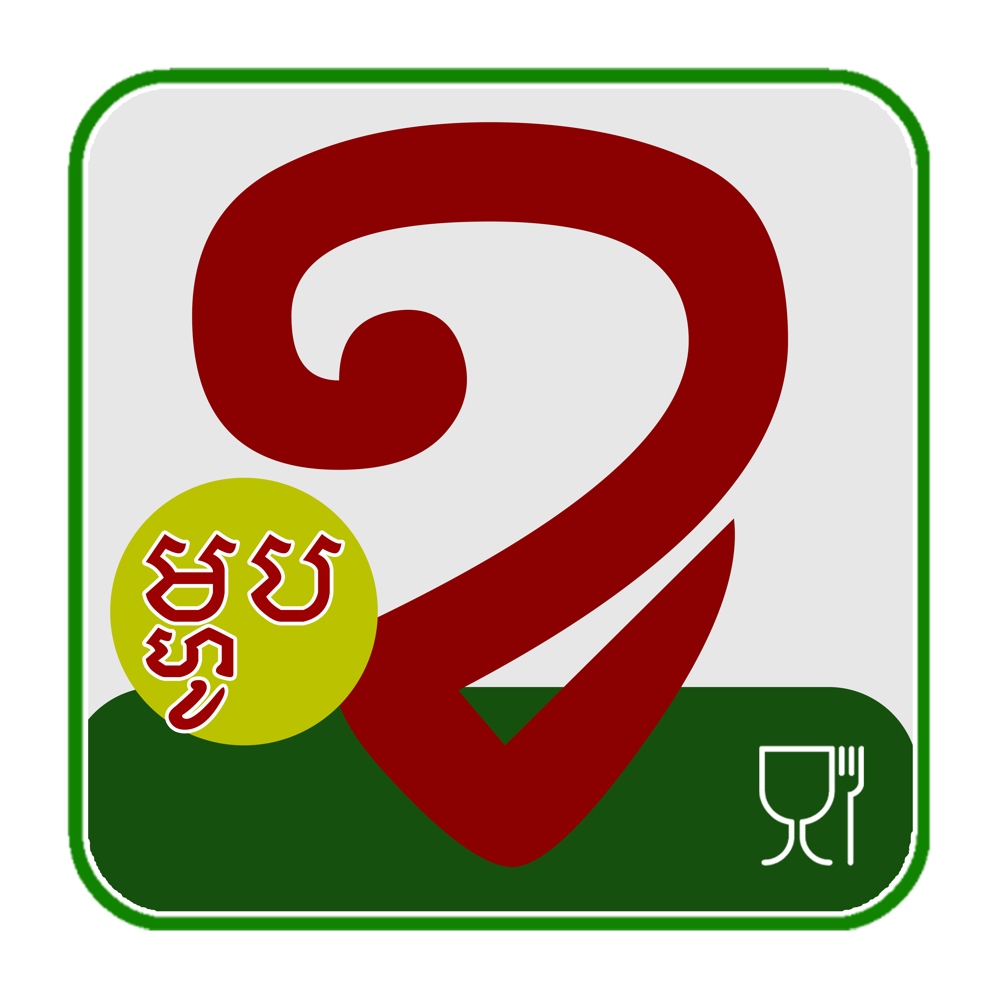

<html lang="km">
<head>
  <meta charset="UTF-8">
  <meta name="viewport" content="width=device-width, initial-scale=1.0">
  <title>អាហារ នៃ ក្តី ស្រលាញ់</title>
  <link href="https://cdn.jsdelivr.net/npm/bootstrap@5.3.0/dist/css/bootstrap.min.css" rel="stylesheet">
  <link href="https://cdn.jsdelivr.net/npm/bootstrap-icons/font/bootstrap-icons.css" rel="stylesheet">
  <link href="https://fonts.googleapis.com/css2?family=Noto+Serif+Khmer:wght@400;700&display=swap" rel="stylesheet">
  <link rel="stylesheet" href="style.css">
</head>
<body>
  <header class="header py-3">
    <nav class="navbar navbar-expand-lg">
      

        <a class="navbar-brand" href="#">
          
          អាហារ នៃ ក្តី ស្រលាញ់
        </a>
        

          <ul class="navbar-nav ms-auto">
            <li class="nav-item"><a href="#" class="nav-link menu-btn" onclick="showAllMeals()">ទំព័រដើម</a></li>
            <li class="nav-item"><a href="#" class="nav-link menu-btn about" onclick="showinfor()">ពត័មានបន្ថែម</a></li>
            <li class="nav-item"><a href="#" class="nav-link menu-btn" id="currencyToggle">ប្តូរទៅ KHR</a></li>
          </ul>
        

      

    </nav>
  </header>

  <section class="main-content">
    

      

      

      

        

          <input type="text" id="searchInput" class="form-control mb-3" placeholder="ស្វែងរកម្ហូប...">
          

        

        <aside class="col-lg-4 aside-1 p-4">
          

            <h3>គិតលុយរបស់លោកអ្នក🛒</h3>
            

            
សរុប: 0.00

             
            
ស្កេនដើម្បីទូទាត់ តាមរយះABA

            
0.00

            

              <input type="checkbox" id="addDrink" class="form-check-input">
              <label for="addDrink">បន្ថែមភេសជ្ជៈ ($1 សម្រាប់ទឹក, $2 សម្រាប់ស្រាបៀរ)</label>
            

            <button class="btn btn-success mb-2" onclick="payNow()">ទិញ 💳</button>
            <button class="btn btn-success mb-2" onclick="payWithQR()">ទូទាត់ជាមួយ QR Code</button>
            <button class="btn btn-danger" onclick="clearCart()">លុប</button>
          

          

            <h3>ពត័មានបន្ថែម</h3>
            

              <ul class="list-group flex-fill">
                <li class="list-group-item">ឈ្មោះ: ពាក្យ ដេត</li>
                <li class="list-group-item">ភេទ: ប្រុស</li>
                <li class="list-group-item">អាយុ: ២៣ឆ្នាំ</li>
                <li class="list-group-item">បន្ទប់: ៤១៦</li>
                <li class="list-group-item">វេន: រសៀល</li>
                <li class="list-group-item">លេខទំនាក់ទំនង: 068 656 263</li>
                <li class="list-group-item">អុីម៉ែល: peakmao007@gmail.com</li>
                <li class="list-group-item">សាកលវិទ្យាល័យ: ប៊ែលធី អន្តរជាតិ សាខាទី២</li>
                <li class="list-group-item">ឈ្មោះគ្រូ: Dr. BUT CHOMROEUN</li>
              </ul>
              

                
              

            

          

        </aside>
      

    

  </section>

  

    

      

        

          <h5 class="modal-title" id="checkoutModalLabel">សង្ខេបការបញ្ជាទិញ</h5>
          <button type="button" class="btn-close" data-bs-dismiss="modal" aria-label="Close"></button>
        

        

        

          <button type="button" class="btn btn-secondary" data-bs-dismiss="modal">បិទ</button>
          <button type="button" class="btn btn-success" onclick="confirmOrder()">បញ្ជាក់ការបញ្ជាទិញ</button>
        

      

    

  

  <footer class="footer py-3 text-center">
    

      <a href="https://www.facebook.com/pu.deth.175755/" target="_blank" class="social-link" aria-label="Facebook Profile">
        <i class="bi bi-facebook"></i> Pu Deth
      </a>
      <a href="https://t.me/Peak_Deth" target="_blank" class="social-link" aria-label="Telegram Profile">
        <i class="bi bi-telegram"></i> @Peak_Deth
      </a>
    

    
    
© 2025 ឈ្មោះក្រុមហ៊ុនរបស់ អាហារ នៃ ក្តី ស្រលាញ់ រក្សាសិទ្ធិគ្រប់យ៉ាង។

    
រចនាដោយ <a href="https://t.me/Peak_Deth">ពាក្យ ដេត</a>

  </footer>

  

  
  
</body>
</html>
